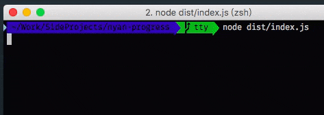

# nyan-progress
A nyan cat progress bar for Node.



---

## Installation
```bash
yarn add nyan-progress
```
or if you use npm instead,
```bash
npm install --save nyan-progress
```

## Usage
```js
import NyanProgress from 'nyan-progress';

const progress = NyanProgress();
progress.start({ total: 100 });

const timer = setInterval(() => {
  progress.tick();

  if (progress.isComplete) {
    clearInterval(timer);
  }
}, 100);
```

The above example will produce the result shown in the gif in the begining.

### options
The `start()` function can pass in an option object, the available options are listed below.

- curr: the start point of the progress. Default: `0`.
- total: the end point of the progress. Default: `100`.
- width: the length of the progress bar. Default: `20`.
- renderThrottle: the interval that the progress update, in milliseconds. Default: `500`.
- message: an object containing the message to show in the progress.
  - downloading: a list of frames to show when downloading. Default: `['Nyaning.  ', 'Nyaning.. ', 'Nyaning...']`.
  - finished: a string to show when the progress is completed. Default: `'Nyaned'`.
  - error: a string to show when the progress is interupted. Default: `'Something nyan wrong...'`.
- callback: callback function to do when completed.

You can also pass the callback function as second argument of the `start()` function.
```js
progress.start({}, callback);
```

The `start()` function also return a promise.
```js
progress.start().then(callback);
```

### API
##### `start(options, callback?)`
The function to nyan the cat.

##### `tick()`
The function that increment `curr` by 1. When `curr` reached to `total`, the progress will stop.

##### `interupt()`
For whatever reason you want to interupt the nyaning, call it. Note that it would not throw any error but display error message in the progress itself.

## License
MIT

## Credits
- [visionmedia/node-progress](https://github.com/visionmedia/node-progress): for inspiring the api and usage.
- [milkandsour/nyanloader](https://github.com/milkandsour/nyanloader): for the awesome simple but cute enough nyan cat text.
